## Skills Icons 💡

Showcase skills in projects or profiles effortlessly ✨

### Quick Start 🚀

Showcase your skills by using the URL below and adding the tech stack icons you want (separated by commas)

```md

```


### Configuration Options 🛠️

| Parameter | Description                        | Required | Default |
|-----------|------------------------------------|----------|---------|
| `i`       | Comma-separated list of icon names | Yes      | /       |
| `perline` | Number of icons per line           | No       | 15      |

### Available Icons 🎨

Below is a complete list of available icons and their IDs. You can use either the full ID or its alias (if available) in the `i` parameter.

| ID | Icon | Alias | ID | Icon | Alias |
|----|------|-------|----|------|-------|
| `actix` | 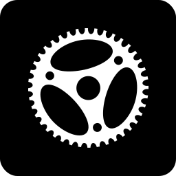 | - | `markdown` |  | `md`|
| `adonisjs` |  | `adonis` | `mastodon` |  | -|
| `aftereffects` |  | `ae` | `materialui` |  | `mui`|
| `airflow` |  | - | `matlab` | 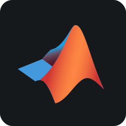 | -|
| `alacritty` | 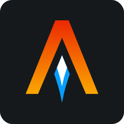 | - | `maven` | 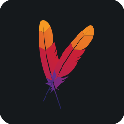 | -|
| `algolia` |  | - | `medium` | 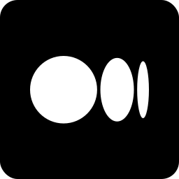 | -|
| `amazonwebservices` |  | `aws` | `mermaid` |  | -|
| `anaconda` | 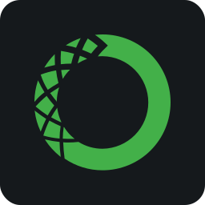 | - | `metasploit` |  | -|
| `androidstudio` | 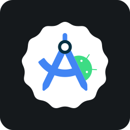 | - | `microsoftcopilot` | 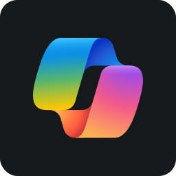 | -|
| `angularjs` | 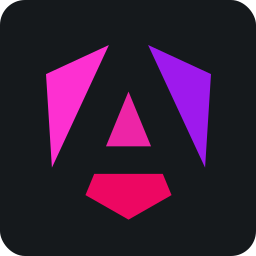 | `angular` | `milligram` | 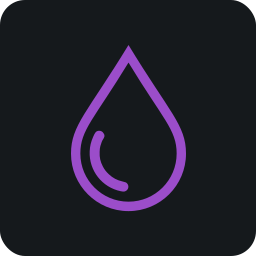 | -|
| `ansible` | 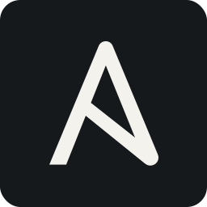 | - | `mongodb` |  | `mongo`|
| `apache` |  | - | `mysql` | 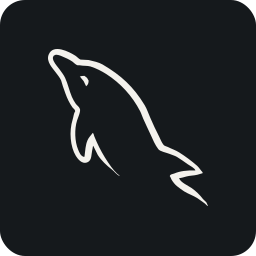 | -|
| `apidog` | 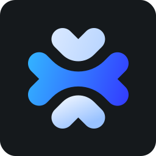 | - | `navicat` | 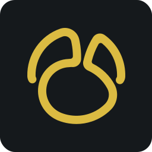 | -|
| `apollo` | 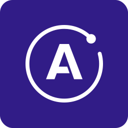 | - | `neo4j` | 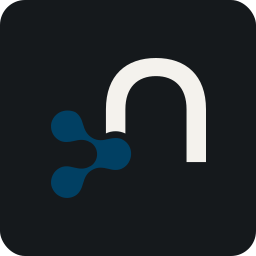 | -|
| `appium` | 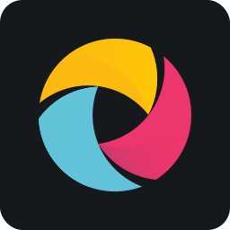 | - | `neon` | 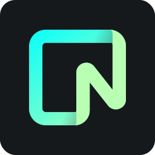 | -|
| `apple` |  | - | `neovim` | 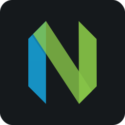 | -|
| `appwrite` | 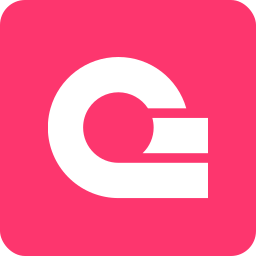 | - | `nestjs` | 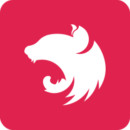 | -|
| `arcbrowser` | 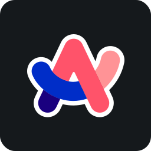 | `arc` | `netbeans` | 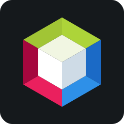 | -|
| `archlinux` | 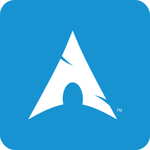 | `arch` | `netlify` | 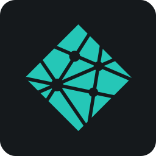 | -|
| `arduino` | 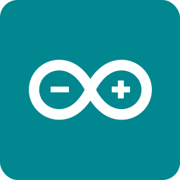 | - | `newrelic` | 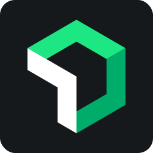 | -|
| `argocd` |  | - | `nextjs` | 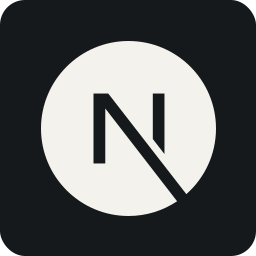 | -|
| `aseprite` | 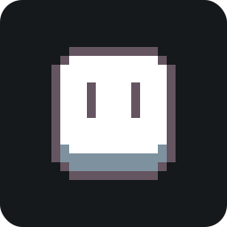 | - | `nextui` |  | -|
| `astro` | 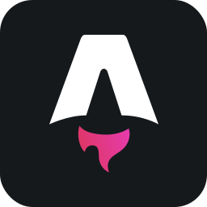 | - | `nginx` | 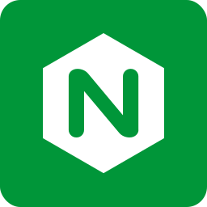 | -|
| `atom` |  | - | `ngrok` |  | -|
| `auth0` |  | - | `nitro` | 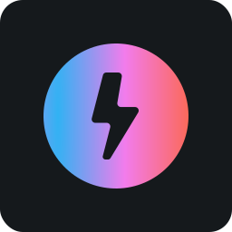 | -|
| `authy` |  | - | `nixos` | 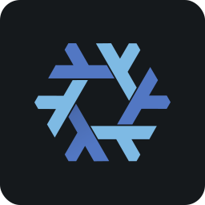 | -|
| `autocad` | 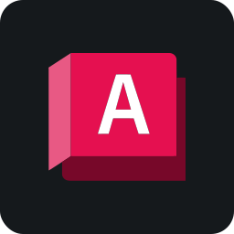 | - | `nodejs` | 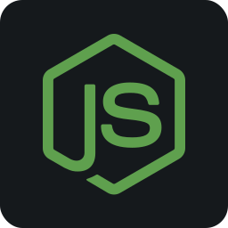 | `node`|
| `avaloniaui` |  | - | `notepadplusplus` | 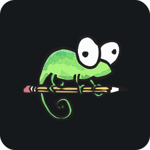 | `notepadpp`|
| `axios` |  | - | `notion` | 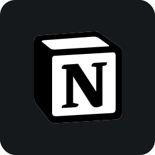 | -|
| `azure` | 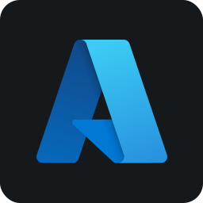 | - | `npm` |  | -|
| `babel` |  | - | `nunjucks` |  | -|
| `bash` | 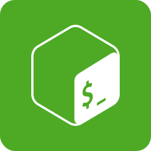 | - | `nuxtjs` | 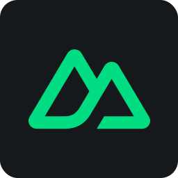 | `nuxt`|
| `bento` | 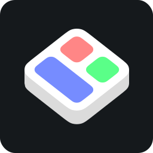 | - | `obs` |  | -|
| `bing` |  | - | `obsidian` | 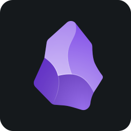 | -|
| `biome` | 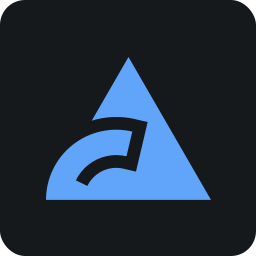 | - | `ocaml` |  | -|
| `blender` |  | - | `ollama` | 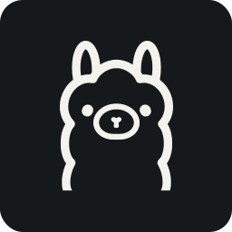 | -|
| `bluesky` | 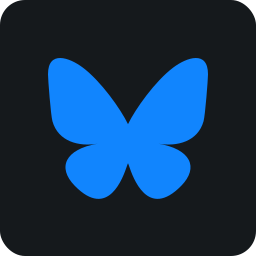 | - | `openlayers` | 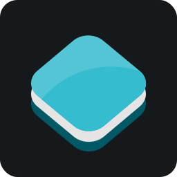 | -|
| `bolt` |  | - | `opentelemetry` |  | `otel`|
| `bootstrap` |  | - | `opera` |  | -|
| `box2d` | 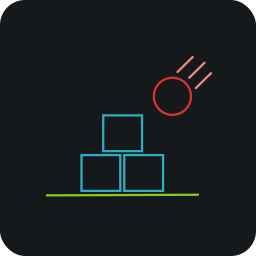 | - | `pandacss` |  | -|
| `brave` |  | - | `pandas` | 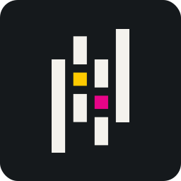 | -|
| `bugsnag` | 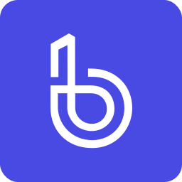 | - | `passportjs` | 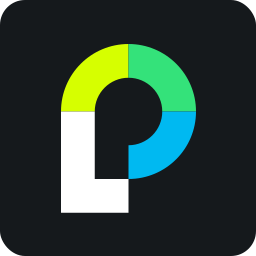 | -|
| `builder` |  | - | `payload` |  | -|
| `bulma` |  | - | `perplexity` |  | -|
| `bun` |  | - | `phoenix` |  | -|
| `c` |  | - | `photoshop` |  | `ps`|
| `camunda` |  | - | `php` |  | -|
| `canva` |  | - | `phpstorm` |  | -|
| `capacitorjs` |  | `capacitor` | `pinia` |  | -|
| `capcut` |  | - | `pinterest` |  | -|
| `chakraui` |  | - | `pkgroll` |  | -|
| `chartjs` |  | - | `plausible` |  | -|
| `chatgpt` |  | - | `playwright` |  | -|
| `chrome` |  | - | `pnpm` |  | -|
| `chromium` |  | - | `pocketbase` |  | `pb`|
| `circleci` |  | - | `postcss` |  | -|
| `claudeai` |  | - | `postgresql` |  | -|
| `clerk` |  | - | `posthog` |  | -|
| `clickhouse` |  | - | `postman` |  | -|
| `clion` |  | - | `powershell` |  | -|
| `cloudflare` |  | - | `preact` |  | -|
| `cloudinary` |  | - | `premierepro` |  | -|
| `cmake` |  | - | `primevue` |  | -|
| `codecov` |  | - | `prisma` |  | -|
| `codepen` |  | - | `prismic` |  | -|
| `coolify` |  | - | `prometheus` |  | -|
| `cpanel` |  | - | `proxmox` |  | -|
| `cpp` |  | - | `psycopg` |  | -|
| `csharp` |  | - | `pug` |  | -|
| `css` |  | - | `pulumi` |  | -|
| `cypress` |  | - | `puppeteer` |  | -|
| `dailydev` |  | - | `pwa` |  | -|
| `daisyui` |  | - | `pycharm` |  | -|
| `dart` |  | - | `pytest` |  | -|
| `databricks` |  | - | `python` |  | -|
| `datadog` |  | - | `pytorch` |  | -|
| `datagrip` |  | - | `qdrant` |  | -|
| `datalore` |  | - | `quasar` |  | -|
| `dbeaver` |  | - | `qwik` |  | -|
| `dbt` |  | - | `r` |  | -|
| `debian` |  | - | `rabbitmq` |  | -|
| `deno` |  | - | `radixui` |  | -|
| `devextreme` |  | - | `railway` |  | -|
| `devto` |  | - | `raspberrypi` |  | -|
| `digitalocean` |  | - | `raylib` |  | -|
| `directus` |  | - | `reactjs` |  | `react`|
| `discord` |  | - | `reactnative` |  | -|
| `discordjs` |  | - | `reactquery` |  | -|
| `django` |  | - | `reactrouter` |  | -|
| `djangorestframework` |  | `drf` | `reddit` |  | -|
| `docker` |  | - | `redis` |  | -|
| `docus` |  | - | `redux` |  | -|
| `docusaurus` |  | - | `rekaui` |  | -|
| `dotnet` |  | - | `render` |  | -|
| `dreamweaver` |  | `dw` | `replit` |  | -|
| `drizzle` |  | - | `resend` |  | -|
| `dropbox` |  | - | `revolt` |  | -|
| `drupal` |  | - | `rolldown` |  | -|
| `duckdb` |  | - | `rollupjs` |  | -|
| `easybuild` |  | - | `ruby` |  | -|
| `eclipseide` |  | - | `rubymine` |  | -|
| `edge` |  | - | `rust` |  | -|
| `elasticsearch` |  | `es` | `rxjs` |  | -|
| `electron` |  | - | `sanity` |  | -|
| `elixir` |  | - | `sap` |  | -|
| `elysiajs` |  | `elysia` | `sass` |  | -|
| `emberjs` |  | - | `scala` |  | -|
| `emelentplus` |  | - | `scikitlearn` |  | `sclearn`|
| `erlang` |  | - | `semanticui` |  | -|
| `esbuild` |  | - | `sentry` |  | -|
| `eslint` |  | - | `sequelize` |  | -|
| `expo` |  | - | `serverless` |  | -|
| `expressjs` |  | `express` | `servicenow` |  | -|
| `facebook` |  | `fb` | `seyfert` |  | -|
| `fastapi` |  | - | `shadcnui` |  | -|
| `fastify` |  | - | `shopify` |  | -|
| `figma` |  | - | `signal` |  | -|
| `firebase` |  | - | `skeletonui` |  | -|
| `firefox` |  | - | `slidev` |  | -|
| `flask` |  | - | `snowflake` |  | -|
| `fleet` |  | - | `snyk` |  | -|
| `flowbite` |  | - | `socketio` |  | -|
| `flutter` |  | - | `solidity` |  | -|
| `flutterflow` |  | - | `solidjs` |  | `solid`|
| `flyio` |  | - | `spark` |  | -|
| `fortran` |  | - | `sphinx` |  | -|
| `framer` |  | - | `springboot` |  | `spring`|
| `fresh` |  | - | `spyder` |  | -|
| `gatsby` |  | - | `sqlalchemy` |  | -|
| `gimp` |  | - | `sqlite` |  | -|
| `git` |  | - | `sqlserver` |  | -|
| `gitbook` |  | - | `stackblitz` |  | -|
| `gitea` |  | - | `stackoverflow` |  | `so`|
| `github` |  | `gh` | `starlight` |  | -|
| `githubactions` |  | `ghactions` | `stata` |  | -|
| `gitkraken` |  | - | `steam` |  | -|
| `gitlab` |  | - | `storyblok` |  | -|
| `gitmind` |  | - | `storybook` |  | -|
| `gleam` |  | - | `strapi` |  | -|
| `gmail` |  | - | `streamlit` |  | -|
| `godot` |  | - | `stripe` |  | -|
| `goland` |  | - | `sublime` |  | -|
| `golang` |  | `go` | `supabase` |  | -|
| `googlecloud` |  | `gcloud, gcp` | `surrealdb` |  | -|
| `googledrive` |  | `drive` | `svelte` |  | -|
| `googlegemini` |  | `gemini` | `swagger` |  | -|
| `googleidx` |  | `idx` | `swc` |  | -|
| `gradle` |  | - | `swift` |  | -|
| `grafana` |  | - | `swiftui` |  | -|
| `graphql` |  | - | `swiper` |  | -|
| `gridsome` |  | - | `t0ggles` |  | -|
| `gsap` |  | - | `tabby` |  | -|
| `hashnode` |  | - | `tailwindcss` |  | `tailwind`|
| `haxe` |  | - | `tauri` |  | -|
| `headlessui` |  | - | `telegram` |  | -|
| `heroku` |  | - | `tensorflow` |  | -|
| `hexo` |  | - | `terraform` |  | -|
| `hibernate` |  | - | `threads` |  | -|
| `hono` |  | - | `threejs` |  | -|
| `hostgator` |  | - | `thunderbird` |  | -|
| `html` |  | - | `tinacms` |  | -|
| `hub` |  | - | `trpc` |  | -|
| `huggingface` |  | - | `turso` |  | -|
| `hugo` |  | - | `twilio` |  | -|
| `iceberg` |  | - | `twitter` |  | -|
| `illustrator` |  | - | `typeorm` |  | -|
| `indesign` |  | - | `typescript` |  | `ts`|
| `inertiajs` |  | - | `ubuntu` |  | -|
| `insomnia` |  | - | `udemy` |  | -|
| `instagram` |  | `ig` | `umbraco` |  | -|
| `intellijidea` |  | `intellij` | `unity` |  | -|
| `ionic` |  | - | `unocss` |  | -|
| `jamstack` |  | - | `unrealengine` |  | -|
| `jasmine` |  | - | `upstash` |  | -|
| `java` |  | - | `vala` |  | -|
| `javascript` |  | `js` | `vegaspro` |  | -|
| `jenkins` |  | - | `vercel` |  | -|
| `jest` |  | - | `vike` |  | -|
| `jetpackcompose` |  | - | `vim` |  | -|
| `joomla` |  | - | `virtualbox` |  | -|
| `jquery` |  | - | `visualstudio` |  | -|
| `json` |  | - | `visualstudiocode` |  | `vscode`|
| `julia` |  | - | `vite` |  | -|
| `jupyter` |  | - | `vitepress` |  | -|
| `jwt` |  | - | `vitest` |  | -|
| `kafka` |  | - | `vivaldi` |  | -|
| `kaggle` |  | - | `vk` |  | -|
| `kalilinux` |  | `kali` | `vmix` |  | -|
| `kotlin` |  | - | `vmware` |  | -|
| `kubernetes` |  | - | `vuefire` |  | -|
| `langchain` |  | - | `vuejs` |  | `vue`|
| `laravel` |  | - | `vuetify` |  | -|
| `latex` |  | - | `vueuse` |  | -|
| `leetcode` |  | - | `webstorm` |  | -|
| `lemonsqueezy` |  | - | `whatsapp` |  | -|
| `less` |  | - | `windicss` |  | -|
| `lightroom` |  | - | `windows` |  | -|
| `linkedin` |  | - | `winui` |  | -|
| `linux` |  | - | `wordpress` |  | `wp`|
| `linuxmint` |  | - | `x` |  | -|
| `logto` |  | - | `xampp` |  | -|
| `lottiefiles` |  | `lottie` | `xcode` |  | -|
| `lua` |  | - | `xd` |  | -|
| `lucia` |  | - | `yaml` |  | -|
| `lucide` |  | - | `yarn` |  | -|
| `macos` |  | - | `zeabur` |  | -|
| `mambaui` |  | - | `zed` |  | -|
| `manifoldjs` |  | `manifold` | `zig` |  | -|
| `manjaro` |  | - | `zod` |  | -|
| `mapbox` |  | - | `zorinos` |  | -|
| `mariadb` |  | - | `zustand` |  | -|

### Contributing 🎖️

We welcome contributions from anyone! If you'd like to help, please follow the detailed guidelines in our [CONTRIBUTING.md](.github/CONTRIBUTING.md) file.

#### Ways to Contribute
- Add New Icons: Submit PRs to expand our icon collection.
- Bug Fixes: Help us identify and fix issues.
- Documentation: Help improve documentation.

#### Development Setup

```bash
# Clone the repository
git clone https://github.com/sckrp/skills-icons.git

# Install dependencies
pnpm install # or npm install

# Run development server
pnpm dev # or npm run dev
```

For more instructions on how to get started, check out the guidelines in the [CONTRIBUTING.md](.github/CONTRIBUTING.md).

### Docker Usage 🐳

This section provides instructions on building and running the `Skills Icons` project using Docker. Follow the steps below to containerize and manage the application efficiently.

#### Prerequisites

Before you begin, ensure you have the following installed:
- Docker (version 18.09 or higher)

#### Building the Docker Image

To build the Docker image for `Skills Icons`, follow these steps:
1. Open a terminal and navigate to the directory.
2. Run the following command to build the image:
```bash
docker build -t skills-icons .
# or
sudo docker build -t skills-icons .
```

#### Running the Docker Container

Once the image is built, you can run it in a container:
1. Execute the following command:
```bash
docker run -p 3000:3000 skills-icons
# or
sudo docker run -p 3000:3000 skills-icons
```

This command maps port 3000 of your host machine to port 3000 of the container, allowing you to access `Skills Icons` at http://localhost:3000.

### Support 💝

If you find this project helpful, consider:

- Starring the repository
- Sharing it with others
- Contributing to its development

### License 📝

This project is licensed under [MIT License](LICENSE)
