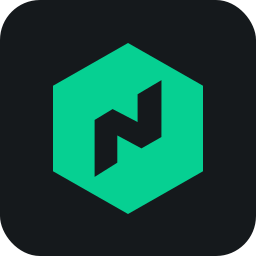
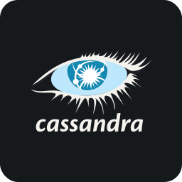
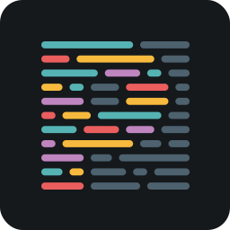
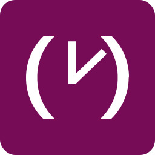

## Skills Icons 💡


### Quick Start 🚀

Showcase your skills by using the URL below and adding the tech stack icons you want (separated by commas)

> [!IMPORTANT]
> We'd really appreciate it if you would consider starring our repository! It helps us gain visibility and support the project.

#### Main URLs 🔗

- https://skills.syvixor.com
- https://skills-icons.vercel.app

```md
[](https://github.com/syvixor/skills-icons)
```

[](https://github.com/syvixor/skills-icons)

### Configuration Options 🛠️

| Parameter | Description                                      | Required | Default |
|-----------|--------------------------------------------------|----------|---------|
| `i`       | Comma-separated list of icon names               | Yes      | /       |
| `perline` | Number of icons per line                         | No       | 15      |
| `radius`  | Icon(s) corner radius (value between 25 and 125) | No       | 25      |

### URL Builder 🏗️

[URL Builder](https://builder.syvixor.com) - A user-friendly tool to quickly generate URLs for various skills icons

### Available Icons 🎨

Below is a complete list of available icons and their IDs. You can use either the full ID or its alias (if available) in the `i` parameter.

| ID | Icon | Alias | ID | Icon | Alias |
|----|------|-------|----|------|-------|
| `8th` |  | - | `lucide` |  | -|
| `activitypub` |  | - | `lynxjs` |  | -|
| `actix` |  | - | `macos` |  | -|
| `adobeaftereffects` |  | `aftereffects, ae` | `magicui` |  | -|
| `adobeaudition` |  | `audition` | `mambaui` |  | -|
| `adobedreamweaver` |  | `dreamweaver` | `manifoldjs` |  | `manifold`|
| `adobeillustrator` |  | `illustrator` | `manjaro` |  | -|
| `adobeindesign` |  | `indesign` | `mapbox` |  | -|
| `adobelightroom` |  | `lightroom` | `mariadb` |  | -|
| `adobephotoshop` |  | `photoshop, ps` | `markdown` |  | `md`|
| `adobepremierepro` |  | `premierepro` | `mastodon` |  | -|
| `adobexd` |  | `xd` | `materialdesign` |  | -|
| `adonisjs` |  | `adonis` | `materialui` |  | `mui`|
| `airflow` |  | - | `matlab` |  | -|
| `aiscript` |  | - | `medium` |  | -|
| `alacritty` |  | - | `medusa` |  | -|
| `algolia` |  | - | `mermaid` |  | -|
| `alpinejs` |  | - | `metasploit` |  | -|
| `alpinelinux` |  | - | `microsoftcopilot` |  | -|
| `amazonwebservices` |  | `aws` | `milligram` |  | -|
| `anaconda` |  | - | `mimir` |  | -|
| `android` |  | - | `minio` |  | -|
| `androidstudio` |  | - | `mongodb` |  | `mongo`|
| `angularjs` |  | `angular` | `motherduck` |  | -|
| `ansible` |  | - | `motion` |  | -|
| `apache` |  | - | `mqtt` |  | -|
| `apachehop` |  | `hop` | `msdos` |  | -|
| `apachejmeter` |  | `jmeter` | `mysql` |  | -|
| `apachemaven` |  | `maven` | `n8n` |  | -|
| `apidog` |  | - | `navicat` |  | -|
| `apifox` |  | - | `neo4j` |  | -|
| `apollo` |  | - | `neon` |  | -|
| `appian` |  | - | `neovim` |  | -|
| `appium` |  | - | `nestjs` |  | -|
| `apple` |  | - | `netbeans` |  | -|
| `appwrite` |  | - | `netlify` |  | -|
| `arcbrowser` |  | `arc` | `newrelic` |  | -|
| `archlinux` |  | `arch` | `nextdns` |  | -|
| `archunit` |  | - | `nextjs` |  | -|
| `arduino` |  | - | `nginx` |  | -|
| `argocd` |  | - | `ngrok` |  | -|
| `arturo` |  | - | `nim` |  | -|
| `aseprite` |  | - | `nitro` |  | -|
| `astro` |  | - | `nixos` |  | -|
| `atom` |  | - | `nodejs` |  | `node`|
| `auth0` |  | - | `nodered` |  | -|
| `authy` |  | - | `nomad` |  | -|
| `autocad` |  | - | `notepadplusplus` |  | `notepadpp`|
| `avaloniaui` |  | - | `notion` |  | -|
| `axios` |  | - | `npm` |  | -|
| `azul` |  | - | `nuget` |  | -|
| `azure` |  | - | `nunjucks` |  | -|
| `babel` |  | - | `nuxtjs` |  | `nuxt`|
| `babylonjs` |  | - | `obs` |  | -|
| `backbonejs` |  | - | `obsidian` |  | -|
| `balenaetcher` |  | - | `obtainium` |  | -|
| `ballerina` |  | - | `ocaml` |  | -|
| `baseui` |  | - | `ollama` |  | -|
| `bash` |  | - | `onyx` |  | -|
| `beagleboard` |  | - | `openlayers` |  | -|
| `beeflang` |  | `beef` | `openondemand` |  | `ood`|
| `bento` |  | - | `opentelemetry` |  | `otel`|
| `betterauth` |  | - | `openvpn` |  | -|
| `bevy` |  | - | `openweather` |  | -|
| `bing` |  | - | `openwebui` |  | -|
| `biome` |  | - | `opera` |  | -|
| `bitbucket` |  | - | `oracle` |  | -|
| `blender` |  | - | `overleaf` |  | -|
| `bluesky` |  | - | `p4` |  | -|
| `bolt` |  | - | `pandacss` |  | -|
| `bookstack` |  | - | `pandas` |  | -|
| `bootstrap` |  | - | `parcel` |  | -|
| `box2d` |  | - | `passportjs` |  | -|
| `brave` |  | - | `payload` |  | -|
| `bugsnag` |  | - | `penpot` |  | -|
| `builder` |  | - | `perplexity` |  | -|
| `bullmq` |  | - | `phoenix` |  | -|
| `bulma` |  | - | `php` |  | -|
| `bun` |  | - | `phpstorm` |  | -|
| `burncloud` |  | - | `pinia` |  | -|
| `c` |  | - | `pinterest` |  | -|
| `cairo` |  | - | `pkgroll` |  | -|
| `cakebuild` |  | - | `platformio` |  | -|
| `cakephp` |  | - | `plausible` |  | -|
| `camtasia` |  | - | `playwright` |  | -|
| `camunda` |  | - | `pnpm` |  | -|
| `canva` |  | - | `pocketbase` |  | `pb`|
| `capacitorjs` |  | `capacitor` | `podman` |  | -|
| `capcut` |  | - | `polars` |  | -|
| `cassandra` |  | - | `postcss` |  | -|
| `chakraui` |  | - | `postgresql` |  | -|
| `chartjs` |  | - | `posthog` |  | -|
| `chatgpt` |  | - | `postman` |  | -|
| `chromium` |  | - | `powershell` |  | -|
| `circleci` |  | - | `preact` |  | -|
| `civitai` |  | - | `prettier` |  | -|
| `claudeai` |  | - | `primevue` |  | -|
| `clerk` |  | - | `prisma` |  | -|
| `clickhouse` |  | - | `prismic` |  | -|
| `clion` |  | - | `procure` |  | -|
| `clojure` |  | - | `prometheus` |  | -|
| `cloudflare` |  | - | `protoncalendar` |  | -|
| `cloudinary` |  | - | `protondrive` |  | -|
| `cmake` |  | - | `protonmail` |  | -|
| `codeberg` |  | - | `protonpass` |  | -|
| `codecov` |  | - | `protonvpn` |  | -|
| `codeforces` |  | - | `protonwallet` |  | -|
| `codeigniter` |  | - | `proxmox` |  | -|
| `codepen` |  | - | `psycopg` |  | -|
| `coffeescript` |  | - | `pug` |  | -|
| `comfyui` |  | - | `pulumi` |  | -|
| `commitlint` |  | - | `puppeteer` |  | -|
| `confluence` |  | - | `pwa` |  | -|
| `cookiecutter` |  | - | `pycharm` |  | -|
| `coolify` |  | - | `pygame` |  | -|
| `coze` |  | - | `pypi` |  | -|
| `cpanel` |  | - | `pyramid` |  | -|
| `cpp` |  | - | `pytest` |  | -|
| `crystal` |  | - | `python` |  | -|
| `csharp` |  | - | `pytorch` |  | -|
| `css` |  | - | `pytorch3d` |  | -|
| `css3` |  | - | `qdrant` |  | -|
| `cucumber` |  | - | `qtwidgets` |  | -|
| `curseforge` |  | - | `quasar` |  | -|
| `cursor` |  | - | `qubesos` |  | -|
| `cypress` |  | - | `qwik` |  | -|
| `d3js` |  | `d3` | `r` |  | -|
| `dailydev` |  | - | `rabbitmq` |  | -|
| `daisyui` |  | - | `radixui` |  | -|
| `dart` |  | - | `railway` |  | -|
| `databricks` |  | - | `raspberrypi` |  | -|
| `datadog` |  | - | `raylib` |  | -|
| `datagrip` |  | - | `reactdatepicker` |  | -|
| `datalore` |  | - | `reacthookform` |  | -|
| `datefns` |  | - | `reactjs` |  | `react`|
| `dbeaver` |  | - | `reactnative` |  | -|
| `dbt` |  | - | `reactquery` |  | -|
| `debian` |  | - | `reactrouter` |  | -|
| `deepseek` |  | - | `readthedocs` |  | -|
| `deno` |  | - | `reddit` |  | -|
| `designali` |  | - | `redis` |  | -|
| `devto` |  | - | `redux` |  | -|
| `digitalocean` |  | - | `refine` |  | -|
| `directus` |  | - | `regex` |  | -|
| `discord` |  | - | `reglejs` |  | `regle`|
| `discordbots` |  | - | `rekaui` |  | -|
| `discordjs` |  | - | `render` |  | -|
| `disqus` |  | - | `replit` |  | -|
| `django` |  | - | `resend` |  | -|
| `djangorestframework` |  | `drf` | `rest` |  | -|
| `dlang` |  | - | `revolt` |  | -|
| `dndkit` |  | - | `rider` |  | -|
| `docker` |  | - | `rolldown` |  | -|
| `docus` |  | - | `rollupjs` |  | -|
| `docusaurus` |  | - | `ruby` |  | -|
| `dotnet` |  | - | `rubymine` |  | -|
| `drizzle` |  | - | `rust` |  | -|
| `dropbox` |  | - | `rxjs` |  | -|
| `drupal` |  | - | `sanity` |  | -|
| `duckdb` |  | - | `sap` |  | -|
| `easybuild` |  | - | `sass` |  | -|
| `eclipseide` |  | - | `scala` |  | -|
| `edge` |  | - | `scikitlearn` |  | `sclearn`|
| `ejs` |  | - | `semanticui` |  | -|
| `elasticsearch` |  | `es` | `sentry` |  | -|
| `electron` |  | - | `sequelize` |  | -|
| `element` |  | - | `serverless` |  | -|
| `elementplus` |  | - | `servicenow` |  | -|
| `elixir` |  | - | `session` |  | -|
| `elysiajs` |  | `elysia` | `seyfert` |  | -|
| `emberjs` |  | - | `shadcnui` |  | -|
| `erlang` |  | - | `shiki` |  | -|
| `esbuild` |  | - | `shopify` |  | -|
| `eslint` |  | - | `signal` |  | -|
| `etcd` |  | - | `simpledirectmedialayer` |  | `sdl`|
| `expo` |  | - | `singlespa` |  | -|
| `expressjs` |  | `express` | `singularity` |  | -|
| `facebook` |  | `fb` | `skeletonui` |  | -|
| `fastapi` |  | - | `sketch` |  | -|
| `fastify` |  | - | `slack` |  | -|
| `fdroid` |  | - | `slidev` |  | -|
| `featuresliceddesign` |  | `fsd` | `slint` |  | -|
| `fedora` |  | - | `slurm` |  | -|
| `fiber` |  | - | `snipcart` |  | -|
| `figma` |  | - | `snowflake` |  | -|
| `filezilla` |  | - | `snyk` |  | -|
| `filmora` |  | - | `soap` |  | -|
| `firebase` |  | - | `socketio` |  | -|
| `firefox` |  | - | `solidity` |  | -|
| `fivetran` |  | - | `solidjs` |  | `solid`|
| `flask` |  | - | `solr` |  | -|
| `fleet` |  | - | `soundbridge` |  | -|
| `flowbite` |  | - | `spark` |  | -|
| `flutter` |  | - | `sphinx` |  | -|
| `flutterflow` |  | - | `springboot` |  | `spring`|
| `flyio` |  | - | `spyder` |  | -|
| `forem` |  | - | `sqlalchemy` |  | -|
| `fortran` |  | - | `sqlite` |  | -|
| `framer` |  | - | `sqlserver` |  | -|
| `freebsd` |  | - | `sst` |  | -|
| `freecad` |  | - | `stackblitz` |  | -|
| `fresh` |  | - | `stackoverflow` |  | `so`|
| `fsharp` |  | - | `stanjs` |  | -|
| `gatsby` |  | - | `starlight` |  | -|
| `ghostty` |  | - | `stata` |  | -|
| `gimp` |  | - | `steam` |  | -|
| `gin` |  | - | `stimulus` |  | -|
| `git` |  | - | `storyblok` |  | -|
| `gitbook` |  | - | `storybook` |  | -|
| `gitea` |  | - | `strapi` |  | -|
| `github` |  | `gh` | `streamlit` |  | -|
| `githubactions` |  | `ghactions` | `stride` |  | -|
| `githubcopilot` |  | `ghcopilot` | `stripe` |  | -|
| `githubpages` |  | `ghpages` | `sublime` |  | -|
| `gitkraken` |  | - | `suitecrm` |  | -|
| `gitlab` |  | - | `supabase` |  | -|
| `gitlocalize` |  | - | `surrealdb` |  | -|
| `gitmind` |  | - | `svelte` |  | -|
| `gitpod` |  | - | `svg` |  | -|
| `gleam` |  | - | `swagger` |  | -|
| `gmail` |  | - | `swc` |  | -|
| `gnu` |  | - | `swift` |  | -|
| `godot` |  | - | `swiftui` |  | -|
| `goland` |  | - | `swiper` |  | -|
| `golang` |  | `go` | `swr` |  | -|
| `googleadk` |  | - | `t0ggles` |  | -|
| `googleadsense` |  | `gadsense` | `tabby` |  | -|
| `googlechrome` |  | `chrome` | `tailwindcss` |  | `tailwind`|
| `googlecloud` |  | `gcloud, gcp` | `tanstack` |  | -|
| `googlecolaboratory` |  | - | `tauri` |  | -|
| `googledrive` |  | `drive` | `telegram` |  | -|
| `googlegemini` |  | `gemini` | `tempo` |  | -|
| `googleidx` |  | `idx` | `tensorflow` |  | -|
| `gorm` |  | - | `terraform` |  | -|
| `gradle` |  | - | `testcontainers` |  | -|
| `grafana` |  | - | `threads` |  | -|
| `graphql` |  | - | `threejs` |  | -|
| `gridsome` |  | - | `thunderbird` |  | -|
| `grok` |  | - | `tinacms` |  | -|
| `groq` |  | - | `tinyhttp` |  | -|
| `grpc` |  | - | `trae` |  | -|
| `gruntjs` |  | `grunt` | `traefik` |  | -|
| `gsap` |  | - | `trello` |  | -|
| `hackthebox` |  | `htb` | `trpc` |  | -|
| `hacs` |  | - | `truenascore` |  | `truenas`|
| `handycontrols` |  | - | `truenasenterprise` |  | -|
| `hashnode` |  | - | `truenasscale` |  | -|
| `haskell` |  | - | `turso` |  | -|
| `haxe` |  | - | `twilio` |  | -|
| `headlessui` |  | - | `twine` |  | -|
| `heroku` |  | - | `twitter` |  | -|
| `heroui` |  | - | `typeorm` |  | -|
| `hexo` |  | - | `typescript` |  | `ts`|
| `hibernate` |  | - | `ubuntu` |  | -|
| `homeassistant` |  | - | `udemy` |  | -|
| `homebrew` |  | - | `umami` |  | -|
| `hono` |  | - | `umbraco` |  | -|
| `hoppscotch` |  | - | `unity` |  | -|
| `hostgator` |  | - | `unocss` |  | -|
| `html` |  | - | `unrealengine` |  | -|
| `httpie` |  | - | `upstash` |  | -|
| `hub` |  | - | `vagrant` |  | -|
| `huggingface` |  | - | `vala` |  | -|
| `hugo` |  | - | `valibot` |  | -|
| `hyper` |  | - | `vanillaos` |  | -|
| `iceberg` |  | - | `vaxee` |  | -|
| `ifttt` |  | - | `vegaspro` |  | -|
| `inertiajs` |  | - | `vercel` |  | -|
| `influxdb` |  | - | `vhdl` |  | -|
| `inkscape` |  | - | `videojs` |  | -|
| `insomnia` |  | - | `vike` |  | -|
| `instagram` |  | `ig` | `vim` |  | -|
| `intellijidea` |  | `intellij` | `virtualbox` |  | -|
| `ionic` |  | - | `visualstudio` |  | -|
| `ios` |  | - | `visualstudiocode` |  | `vscode`|
| `jakartaee` |  | - | `vite` |  | -|
| `jamstack` |  | - | `vitepress` |  | -|
| `jasmine` |  | - | `vitepwa` |  | -|
| `java` |  | - | `vitest` |  | -|
| `javascript` |  | `js` | `vivaldi` |  | -|
| `jenkins` |  | - | `vk` |  | -|
| `jest` |  | - | `vlitejs` |  | -|
| `jetpackcompose` |  | - | `vmix` |  | -|
| `jira` |  | - | `vmware` |  | -|
| `jitsi` |  | - | `vuefire` |  | -|
| `joomla` |  | - | `vueform` |  | -|
| `jotai` |  | - | `vuejs` |  | `vue`|
| `jquery` |  | - | `vuepress` |  | -|
| `json` |  | - | `vuetify` |  | -|
| `julia` |  | - | `vueuse` |  | -|
| `junit4` |  | - | `weaviate` |  | -|
| `junit5` |  | - | `weblate` |  | -|
| `jupyter` |  | - | `websocket` |  | `ws`|
| `jwt` |  | - | `webstorm` |  | -|
| `k3s` |  | - | `webstudio` |  | -|
| `kafka` |  | - | `whatsapp` |  | -|
| `kaggle` |  | - | `windicss` |  | -|
| `kalilinux` |  | `kali` | `windows` |  | -|
| `kepware` |  | - | `windowsappsdk` |  | `wasdk`|
| `keras` |  | - | `windsurf` |  | -|
| `keycloak` |  | - | `winui` |  | -|
| `kotlin` |  | - | `woocommerce` |  | -|
| `ktor` |  | - | `wordpress` |  | `wp`|
| `kubernetes` |  | - | `x` |  | -|
| `langchain` |  | - | `xamarin` |  | -|
| `laravel` |  | - | `xaml` |  | -|
| `latex` |  | - | `xampp` |  | -|
| `leaflet` |  | - | `xcode` |  | -|
| `leetcode` |  | - | `xftp` |  | -|
| `lemonsqueezy` |  | - | `xshell` |  | -|
| `less` |  | - | `yaak` |  | -|
| `librepcb` |  | - | `yaml` |  | -|
| `linkedin` |  | - | `yandexen` |  | -|
| `linux` |  | - | `yandexru` |  | -|
| `linuxmint` |  | - | `yarn` |  | -|
| `litestar` |  | - | `yolo` |  | -|
| `litmus` |  | - | `youtube` |  | `yt`|
| `livewire` |  | - | `zeabur` |  | -|
| `lmstudio` |  | - | `zed` |  | -|
| `logto` |  | - | `zen` |  | -|
| `lokalise` |  | - | `zig` |  | -|
| `loki` |  | - | `zod` |  | -|
| `lottiefiles` |  | `lottie` | `zorinos` |  | -|
| `lua` |  | - | `zustand` |  | -|
| `lucia` |  | - | | | |

### Contributing 🎖️

We welcome contributions from anyone! If you'd like to help, please follow the detailed guidelines in our [CONTRIBUTING.md](.github/CONTRIBUTING.md) file.

#### Ways to Contribute
- Add New Icons: Submit PRs to expand our icon collection.
- Bug Fixes: Help us identify and fix issues.
- Documentation: Help improve documentation.

#### Development Setup

```bash
# Clone the repository
git clone https://github.com/syvixor/skills-icons.git

# Install dependencies
pnpm install # or npm install

# Run development server
pnpm dev # or npm run dev
```

For more instructions on how to get started, check out the guidelines in the [CONTRIBUTING.md](.github/CONTRIBUTING.md).

### Docker Usage 🐳

This section provides instructions on building and running the `Skills Icons` project using Docker. Follow the steps below to containerize and manage the application efficiently.

#### Prerequisites

Before you begin, ensure you have the following installed:
- Docker (version 18.09 or higher)

#### Building the Docker Image

To build the Docker image for `Skills Icons`, follow these steps:
1. Open a terminal and navigate to the directory.
2. Run the following command to build the image:
```bash
docker build -t skills-icons .
# or
sudo docker build -t skills-icons .
```

#### Running the Docker Container

Once the image is built, you can run it in a container:
1. Execute the following command:
```bash
docker run -p 3000:3000 skills-icons
# or
sudo docker run -p 3000:3000 skills-icons
```

This command maps port 3000 of your host machine to port 3000 of the container, allowing you to access `Skills Icons` at http://localhost:3000.

### Icon Removal Requests 🚫

We strive to respect all branding guidelines and intellectual property. If you represent a company whose icon is included in this project and you would like it removed, or if you believe we have used an icon in a way that violates your branding guidelines, please open an issue on this repository detailing your request. We will review your request promptly and take appropriate action. We appreciate your understanding and cooperation.

### Support 💝

If you find this project helpful, consider:

- Starring the repository
- Sharing it with others
- Contributing to its development

### Powered By 🛟

This project is deployed and hosted using [Vercel](https://vercel.com)

### License 📝

This project is licensed under [MIT License](LICENSE)
